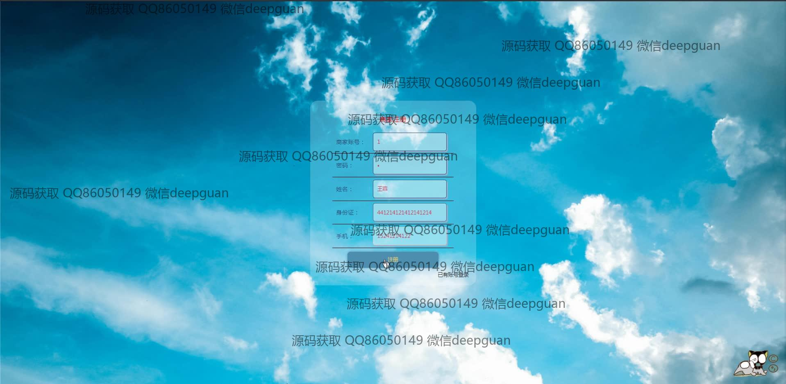
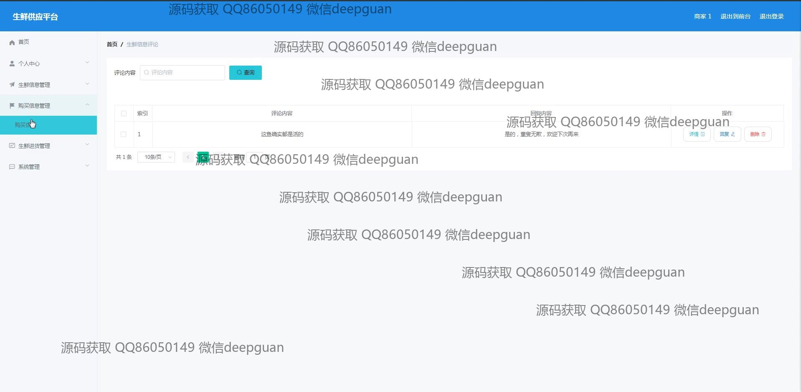
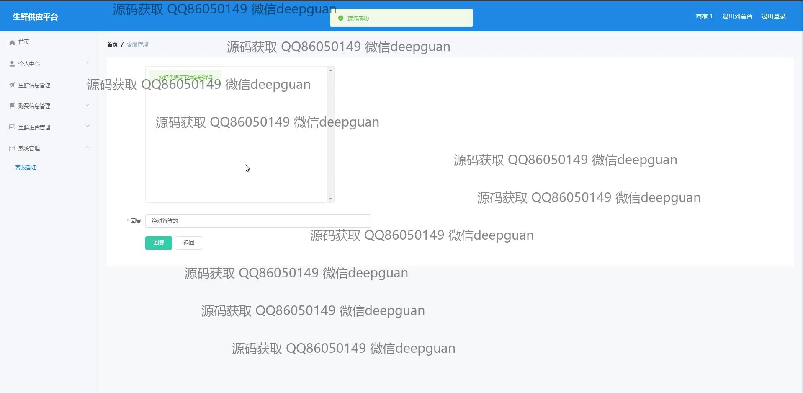
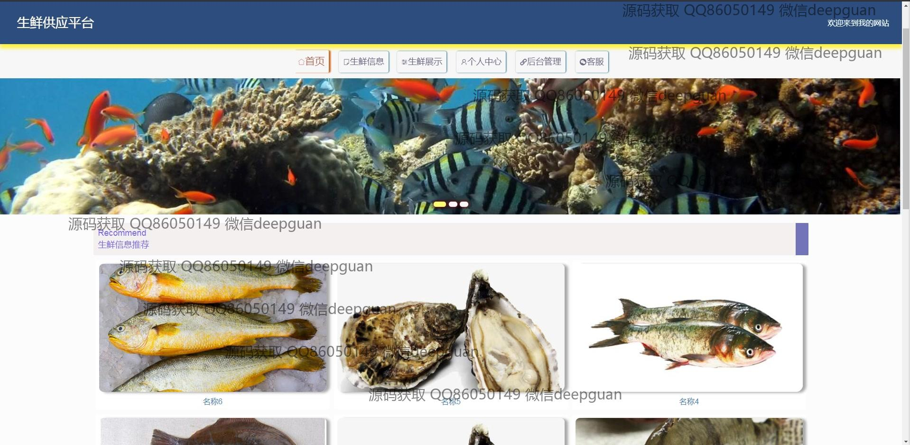

<h1 align="center">的生鲜供应平台vue</h1>

## 简介
生鲜供应平台：支持商家与供应商注册，提供商品信息管理、采购和评论管理，以及用户友好的导航和搜索功能，优化生鲜产品的展示和操作体验。    --计算机毕业设计源码；毕设源码；java毕业设计源码

## 联系方式

<h3 align="center">获取完整代码与数据库文件 + 微信：deepguan QQ: 86050149 QQ群: 783742310</h3>

<h3 align="center">可帮忙远程部署 包运行成功！提供远程部署、修改代码、设计文档指导、代码讲解等服务！</h3>

## 功能介绍（完整见运行截图）
管理员：基本功能包括登录、注册、退出登录和前后台切换；网站首页提供导航栏、轮播图、生鲜信息和商品展示；管理模块涵盖生鲜信息、供应商、商品订单、批发管理、用户管理、评论管理和系统设置，支持商品上传、编辑、删除等操作；可查看和回复评论、进行批量订单操作、查看站点管理数据并维护供应链信息。

用户：可通过登录注册进入系统，访问首页导航栏、生鲜信息、生鲜展示等模块；支持商品搜索、浏览商品详情、加入购物车、在线付款及查看购买记录；个人中心模块提供信息查看和修改、订单查询、地址管理及商品收藏等功能；用户还能参与评论互动，管理个人评论记录，提升购物体验。

商家：登录后可进行商品管理，包括商品录入、编辑、上传图片和富文本详情描述；支持对库存数量、价格、类型等信息的修改；采购管理功能包括供应商注册、采购订单查询和批量处理；商家还可通过系统查看供应链数据和购买记录，优化商品运营。

供应商：支持账户注册、信息编辑和维护；可输入和更新供应商名称、负责人信息、联系方式和地址等；提供进货数据管理模块，记录进货价格、数量、总价和进货日期；还可以参与平台生鲜展示，与商家进行商品交易与合作。

## 运行截图

本代码来源于网络,仅供学习参考使用!

